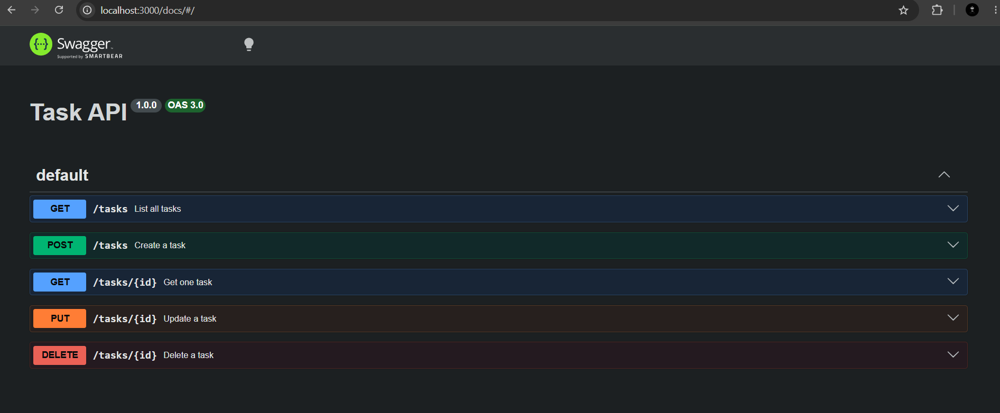

# Task API

A small CRUD API for managing a to-do list, built with Node.js and Express.

## Run it

\`\`\`
npm install
node index.js
\`\`\`

Server runs on http://localhost:3000

## Endpoints

| Method | Path | Description |
|---|---|---|
| GET | / | API info |
| GET | /health | Health check |
| GET | /tasks | List all tasks |
| GET | /tasks/:id | Get one task |
| POST | /tasks | Create a task |
| PUT | /tasks/:id | Update a task |
| DELETE | /tasks/:id | Delete a task |

## Example request

\`\`\`
curl.exe -i http://localhost:3000/tasks/1
\`\`\`

\`\`\`
HTTP/1.1 200 OK
Content-Type: application/json; charset=utf-8

{"id":1,"title":"Buy milk","done":false}
\`\`\`

## Swagger UI

Available at http://localhost:3000/docs

## Notes

Data is stored in memory only — restarting the server resets all tasks to the original 3 examples.
